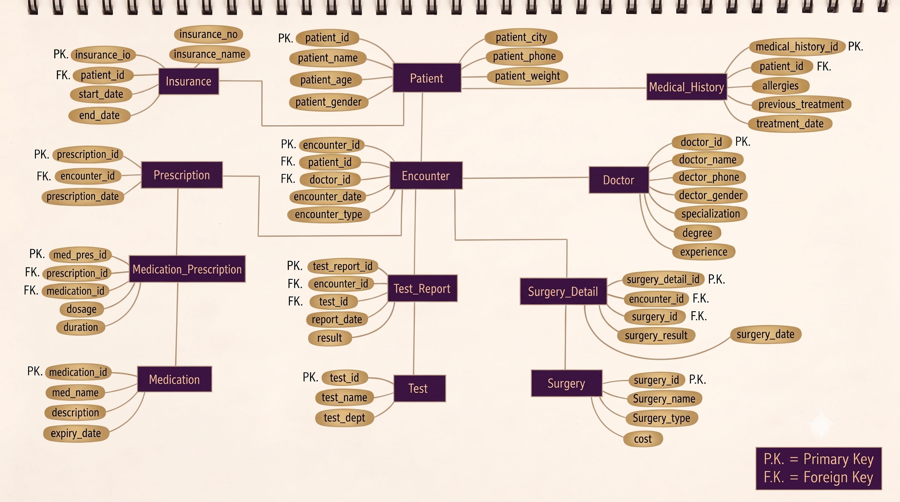

# Healthcare Record Management System (HRMS) – SQL Database Design

## 📌 Project Overview
This project is a relational database system designed to manage core hospital operations and patient healthcare records. It tracks patient visits (encounters), consulting doctors, medical histories, insurance details, diagnostic lab tests, surgeries, and multi-medication prescriptions using structured tables and primary/foreign key relationships.

---

## 🎯 Project Objectives
* Design a clean relational schema to store and retrieve patient health information.
* Center hospital visits around an `Encounter` table to connect doctors, treatments, tests, and prescriptions in one place.
* Separate master lists (medicines, tests, surgery types) from daily hospital transactions to keep data organized and avoid duplicate records.
* Write analytical SQL queries to extract clear business conclusions about revenue, doctor workload, medicine demand, and lab usage.

---

## 🏛️ Entity Relationship Diagram (ERD)

### Key Entities & Structure
* **Patient & Medical History:** Stores patient demographics, active insurance details, past treatments, and known allergies.
* **Doctor:** Stores doctor information, specialization, qualifications, and experience.
* **Encounter:** The main operational table connecting a patient visit with a doctor, visit date, and visit type (Outpatient, Inpatient, Emergency).
* **Diagnostics (Test & Test_Report):** `Test` stores the master catalog of tests, while `Test_Report` stores the specific test results and report dates linked to an encounter.
* **Surgical Procedures (Surgery & Surgery_Detail):** `Surgery` contains standard surgery names and costs, while `Surgery_Detail` records the surgery date, outcome, and patient encounter.
* **Pharmacy (Prescription, Medication & Medication_Prescription):** Manages doctors' prescriptions and uses `Medication_Prescription` as a junction table to track specific medicine dosages and treatment durations.
